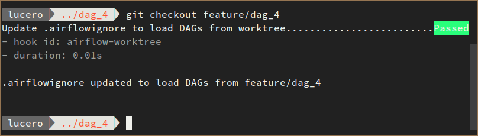

`git-worktree-airflow`
---

This repository contains a post-checkout hook script useful to manage Airflow
`dags_folder`s pointing to bare repositories.

Called after a successful `git checkout`, this hook script
creates a file `.airflowignore` in the root directory of a bare repository,
listing all files and directories except for the worktree directory of the last
*checked out* tree-ish (branch, tag or commit); then the **Airflow UI will show
only the DAGs contained in this directory**.


Table of Contents
---
- [Installation](#installation)
  - [Using `pre-commit`](#using-pre-commit)
  - [Manual](#manual)
- [Usage](#usage)
  - [Recommended option: Using `git-worktree-wrapper`](#recommended-option-using-git-worktree-wrapper)
  - [Alternative option: Using vanilla `git`](#alternative-option-using-vanilla-git)
  - [Examples](#examples)

# Installation

## Using [`pre-commit`](https://pre-commit.com)

Activate this post-checkout hook by adding it to your `.pre-commit-config.yaml`:

```sh
repos:
  - repo: https://github.com/lu0/git-worktree-airflow
    rev: v1.1.2
    hooks:
      - id: airflow-worktree
        name: Update .airflowignore to load DAGs from worktree
        stages: [post-checkout]
        always_run: true
        verbose: true
```

And installing it:

```sh
pre-commit install --hook-type post-checkout
```

## Manual

- Copy or link the script `select-airflow-worktree.sh` into the `hooks`
directory of your `dags_folder` (which should be a bare repository), and rename
it to `post-checkout`.

- Example:

<pre><code>ln -srf select-airflow-worktree.sh <b>/path/to/your/dags_folder</b>/hooks/post-checkout</pre></code>

*Note*: Make the script executable with `chmod +x post-checkout` if you
***copied** the script instead of linking it.


# Usage

## Recommended option: Using [`git-worktree-wrapper`](https://github.com/lu0/git-worktree-wrapper)

- Install [`git-worktree-wrapper`](https://github.com/lu0/git-worktree-wrapper).

- Checkout into a tree-ish object. The hook will be triggered automatically.

    ```sh
    $ git checkout <tree-ish>

        .airflowignore updated to load DAGs from <tree-ish>
    ```

## Alternative option: Using vanilla `git`

1. First ***cd*** into the worktree directory of a tree-ish
    ```language
    $ cd /path/to/the/root/directory/of/the/bare/repo
    $ cd tree-ish
    ```

1. Then trigger the hook

    ```sh
    $ git checkout <tree-ish>

        .airflowignore updated to load DAGs from <tree-ish>
    ```

## Examples

Let's say we have a `dags` folder pointing to a bare repository in `~/dags` with the following structure:

*Note: Directories and files common to bare repositories are hidden.*

```sh
. dags
├── development
│   ├── dag_1.py
│   └── dag_2.py
├── feature
│   └── dag_4
│       ├── dag_1.py
│       ├── dag_2.py
│       ├── dag_3.py
│       ├── dag_4.py
│       └── examples
│           ├── example_dag_1.py
│           └── example_dag_2.py
└── master
    ├── dag_1.py
    ├── dag_2.py
    ├── dag_3.py
    └── examples
        ├── example_dag_1.py
        └── example_dag_2.py
```

And you want the Airflow UI to show the DAGs contained in the `feature/dag_4` worktree.

- If you are using
[`git-worktree-wrapper`](https://github.com/lu0/git-worktree-wrapper) and
[`pre-commit`](#using-pre-commit), just checkout into the tree-ish. You can
checkout from any nested worktree.

    ```sh
    $ git checkout feature/dag_4
    ```
    


- If you are using vanilla `git`:

    ```language
    $ cd ~/dags
    $ cd feature/dag_4
    $ git checkout feature/dag_4

        .airflowignore updated to load DAGs from feature/dag_4
    ```

Either way, the post-checkout hook will create a file named `.airflowignore` with the following contents:

*Note: Directories and files common to bare repositories are hidden.*

```sh
development
master
```

If you trigger the hook in tree-ish `development`, `.airflowignore` will look like this:

*Note: Directories and files common to bare repositories are hidden.*

```sh
feature
master
```
